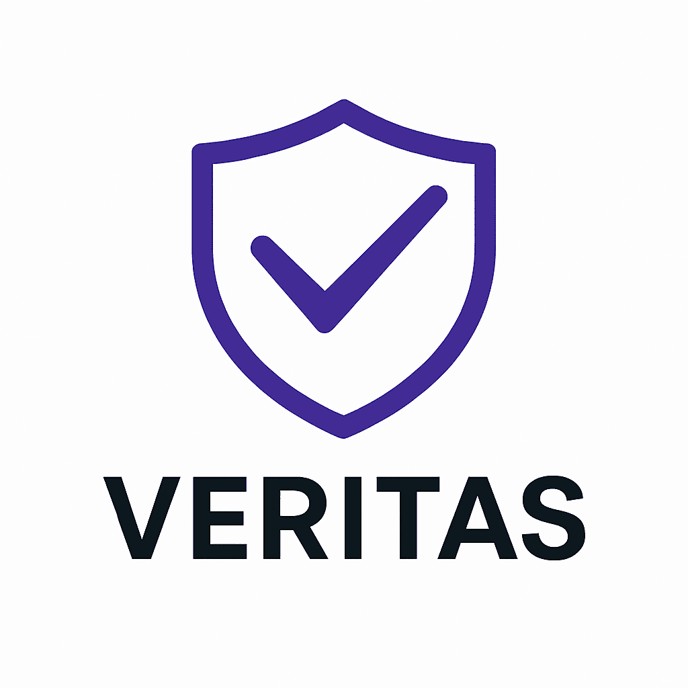

# Veritas

[](https://github.com/rebeccapowell/Veritas/actions/workflows/ci.yml)
[](https://github.com/rebeccapowell/Veritas/actions/workflows/docs.yml)
[](https://www.nuget.org/packages/Veritas)

Veritas is a .NET library for validating and generating a wide range of real‑world identifiers across finance, tax, energy, identity, logistics and more.

> **⚠️ Caution**
> Most of this code was agentically coded. Review and test thoroughly before relying on it in production. Feedback via GitHub issues and merge requests is greatly appreciated.

## Install

```bash
dotnet add package Veritas --version 1.0.3
```

## Usage

```csharp
// Validate an IBAN
Finance.Iban.TryValidate("FR14 2004 1010 0505 0001 3M02 606", out var iban);
Console.WriteLine(iban.IsValid);            // True

// Generate an IMEI
Telecom.Imei.TryGenerate(default, stackalloc char[15], out var written);

// Bulk generate GTIN-13 codes
foreach (var s in Bulk.GenerateMany((dst, rng) => {
    var ok = Logistics.Gtin.TryGenerate(13, new GenerationOptions { Seed = rng.Next() }, dst, out var w);
    return (ok, w);
}, count: 3, seed: 42))
{
    Console.WriteLine(s);
}
```

## Supported identifiers

### Finance

| Identifier | Country/Region | Validation & Generation | Docs |
|------------|----------------|-------------------------|------|
| IBAN | International | ISO 7064 mod 97; BBAN-based generation | <xref:Veritas.Finance.Iban> |
| BIC/SWIFT | International | format check | <xref:Veritas.Finance.Bic> |
| ISIN | International | Luhn checksum | <xref:Veritas.Finance.Isin> |
| RF Creditor Reference | International | ISO 11649 mod 97; generation | <xref:Veritas.Finance.Rf> |
| Payment card PAN | International | Luhn checksum; test generation | <xref:Veritas.Finance.Pan> |
| ABA Routing | US | weighted mod 11 checksum | <xref:Veritas.Finance.AbaRouting> |
| CLABE | Mexico | weighted mod 11 checksum; generation | <xref:Veritas.Finance.Clabe> |
| LEI | International | ISO 7064 mod 97 checksum; generation | <xref:Veritas.Finance.Lei> |
| SEDOL | UK | weighted mod 10 checksum; generation | <xref:Veritas.Finance.Sedol> |
| CUSIP | US/Canada | weighted mod 10 checksum; generation | <xref:Veritas.Finance.Cusip> |
| MIC | Global | structural check | <xref:Veritas.Finance.Mic> |
| WKN | Germany | structural check | <xref:Veritas.Finance.Wkn> |

### Energy

| Identifier | Country/Region | Validation & Generation | Docs |
|------------|----------------|-------------------------|------|
| EIC | International | ISO 7064 mod 37,2 checksum; generation | <xref:Veritas.Energy.Eic> |
| MPAN | GB | weighted mod 11 checksum; generation | <xref:Veritas.Energy.GB.Mpan> |
| MPRN | GB | length & format | <xref:Veritas.Energy.GB.Mprn> |
| Energy EAN | NL | GS1 mod 10 checksum; generation | <xref:Veritas.Energy.NL.EnergyEan> |
| CUPS | ES | mod 529 checksum; generation | <xref:Veritas.Energy.ES.Cups> |
| MaLo | DE | weighted checksum; generation | <xref:Veritas.Energy.DE.Malo> |
| MeLo | DE | weighted checksum; generation | <xref:Veritas.Energy.DE.Melo> |
| ZPN | DE | weighted checksum; generation | <xref:Veritas.Energy.DE.Zpn> |
| PRM | FR | structural check | <xref:Veritas.Energy.FR.Prm> |
| POD | IT | structural check | <xref:Veritas.Energy.IT.Pod> |
| PDR | IT | structural check | <xref:Veritas.Energy.IT.Pdr> |

### Identity

| Identifier | Country/Region | Validation & Generation | Docs |
|------------|----------------|-------------------------|------|
| UUID/GUID | Global | structural check; generation | <xref:Veritas.Identity.Uuid> |
| ULID | Global | Crockford base32 checksum; generation | <xref:Veritas.Identity.Ulid> |
| NanoID | Global | custom alphabet; generation | <xref:Veritas.Identity.NanoId> |
| KSUID | Global | base62; generation | <xref:Veritas.Identity.Ksuid> |
| Email | Global | syntax check | <xref:Veritas.Identity.Email> |
| Phone | Global | E.164 length/format | <xref:Veritas.Identity.Phone> |
| Domain | Global | hostname rules | <xref:Veritas.Identity.Domain> |
| BCP47 tag | Global | structural check | <xref:Veritas.Identity.Bcp47> |
| Ethereum address | Global | EIP-55 checksum | <xref:Veritas.Identity.Ethereum> |
| Base58Check | Global | Base58 + double SHA-256 | <xref:Veritas.Identity.Base58Check> |
| Aadhaar | India | Verhoeff checksum; test generation | <xref:Veritas.Identity.India.Aadhaar> |
| National ID | Luxembourg | Luhn + Verhoeff; test generation | <xref:Veritas.Identity.Luxembourg.NationalId> |

### Tax

| Country | Identifier | Validation & Generation | Docs |
|---------|------------|-------------------------|------|
| AU | ABN | weighted mod 11 checksum; generation | <xref:Veritas.Tax.AU.Abn> |
| AU | TFN | weighted mod 11 checksum; generation | <xref:Veritas.Tax.AU.Tfn> |
| BR | CPF | mod 11 checksum; generation | <xref:Veritas.Tax.BR.Cpf> |
| BR | CNPJ | mod 11 checksum; generation | <xref:Veritas.Tax.BR.Cnpj> |
| CA | SIN | Luhn checksum; generation | <xref:Veritas.Tax.CA.Sin> |
| CA | BN | mod 11 checksum; generation | <xref:Veritas.Tax.CA.Bn> |
| CN | USCC | weighted mod 31 checksum; generation | <xref:Veritas.Tax.CN.Uscc> |
| DE | UStIdNr | mod 97 checksum; generation | <xref:Veritas.Tax.DE.UstIdNr> |
| DE | IdNr | mod 11 checksum; generation | <xref:Veritas.Tax.DE.IdNr> |
| ES | NIF | mod 11 checksum; generation | <xref:Veritas.Tax.ES.Nif> |
| ES | NIE | mod 11 checksum; generation | <xref:Veritas.Tax.ES.Nie> |
| ES | CIF | mod 11 checksum; generation | <xref:Veritas.Tax.ES.Cif> |
| FR | Siren | mod 11 checksum | <xref:Veritas.Tax.FR.Siren> |
| FR | Siret | mod 11 checksum | <xref:Veritas.Tax.FR.Siret> |
| FR | VAT | ISO 7064 mod 97 checksum | <xref:Veritas.Tax.FR.Vat> |
| IN | PAN | mod 36 checksum; generation | <xref:Veritas.Tax.IN.Pan> |
| IN | GSTIN | mod 36 checksum; generation | <xref:Veritas.Tax.IN.Gstin> |
| IT | PIVA | mod 11 checksum | <xref:Veritas.Tax.IT.Piva> |
| NL | BSN | mod 11 checksum | <xref:Veritas.Tax.NL.Bsn> |
| NL | BTW | mod 11 checksum | <xref:Veritas.Tax.NL.Btw> |
| NZ | IRD | mod 11 checksum | <xref:Veritas.Tax.NZ.Ird> |
| PL | NIP | mod 11 checksum | <xref:Veritas.Tax.PL.Nip> |
| PL | REGON | mod 11 checksum | <xref:Veritas.Tax.PL.Regon> |
| PL | PESEL | weighted mod 10 checksum | <xref:Veritas.Tax.PL.Pesel> |
| SE | Personnummer | Luhn checksum | <xref:Veritas.Tax.SE.Personnummer> |
| SE | OrgNr | mod 10 checksum | <xref:Veritas.Tax.SE.OrgNr> |
| UK | NINO | structural check | <xref:Veritas.Tax.UK.Nino> |
| UK | UTR | mod 97 checksum; generation | <xref:Veritas.Tax.UK.Utr> |
| UK | VAT | mod 97 checksum | <xref:Veritas.Tax.UK.Vat> |
| UK | Company Number | structural check | <xref:Veritas.Tax.UK.CompanyNumber> |
| US | SSN | structural check; generation | <xref:Veritas.Tax.US.Ssn> |
| US | EIN | prefix check | <xref:Veritas.Tax.US.Ein> |
| US | ITIN | structural check | <xref:Veritas.Tax.US.Itin> |

### Logistics

| Identifier | Country/Region | Validation & Generation | Docs |
|------------|----------------|-------------------------|------|
| GTIN/EAN/UPC | International | GS1 mod 10 checksum; generation | <xref:Veritas.Logistics.Gtin> |
| GLN | International | GS1 mod 10 checksum; generation | <xref:Veritas.Logistics.Gln> |
| SSCC | International | GS1 mod 10 checksum; generation | <xref:Veritas.Logistics.Sscc> |
| VIN | International | transliteration + weighted checksum | <xref:Veritas.Logistics.Vin> |
| ISO 6346 | International | ISO 6346 checksum | <xref:Veritas.Logistics.Iso6346> |
| AWB | International | mod 7 checksum; generation | <xref:Veritas.Logistics.Awb> |
| IMO | International | mod 10 checksum; generation | <xref:Veritas.Logistics.Imo> |

### Telecom

| Identifier | Country/Region | Validation & Generation | Docs |
|------------|----------------|-------------------------|------|
| IMEI | Global | Luhn checksum; generation | <xref:Veritas.Telecom.Imei> |
| MEID | Global | Luhn checksum; generation | <xref:Veritas.Telecom.Meid> |
| ICCID | Global | Luhn checksum; generation | <xref:Veritas.Telecom.Iccid> |
| MAC | Global | format + OUI | <xref:Veritas.Telecom.Mac> |
| OUI | Global | format check | <xref:Veritas.Telecom.Oui> |
| ASN | Global | range check; generation | <xref:Veritas.Telecom.Asn> |
| IPv4 | Global | structural check | <xref:Veritas.Telecom.Ipv4> |
| IPv6 | Global | structural check | <xref:Veritas.Telecom.Ipv6> |

### IP

| Identifier | Country/Region | Validation & Generation | Docs |
|------------|----------------|-------------------------|------|
| IPOS Application Number | Singapore | Damm checksum; test generation | <xref:Veritas.IP.Singapore.IpApplicationNumber> |

### Education & Media

| Identifier | Country/Region | Validation & Generation | Docs |
|------------|----------------|-------------------------|------|
| ISBN-10 | International | weighted checksum; generation | <xref:Veritas.Media.Isbn10> |
| ISBN-13 | International | GS1 mod 10 checksum; generation | <xref:Veritas.Media.Isbn13> |
| ISSN | International | weighted checksum; generation | <xref:Veritas.Media.Issn> |
| DOI | International | structural check | <xref:Veritas.Education.Doi> |
| ISNI | International | ISO 7064 mod 11,2 checksum; generation | <xref:Veritas.Education.Isni> |
| ISMN | International | mod 10 checksum; generation | <xref:Veritas.Education.Ismn> |
| ISRC | International | structural check | <xref:Veritas.Media.Isrc> |

### Healthcare

| Identifier | Country/Region | Validation & Generation | Docs |
|------------|----------------|-------------------------|------|
| NHS Number | UK | mod 11 checksum; generation | <xref:Veritas.Healthcare.NhsNumber> |
| ORCID | International | ISO 7064 mod 11,2 checksum; generation | <xref:Veritas.Healthcare.Orcid> |
| SNOMED CT Concept ID | International | Verhoeff checksum; test generation | <xref:Veritas.Healthcare.Snomed.SctId> |

## Future identifiers

### Finance
- Bank Routing Numbers for additional countries
- International Securities Broker numbers

### Tax
- US state tax IDs
- EU VAT formats for remaining member states

### Energy
- US EIA plant codes

### Identity & Telecom
- OpenID Connect subject identifiers
- IMSI (mobile subscriber identities)

### Logistics
- UPU S10 postal tracking

Contributions for these and other identifiers are welcome!

